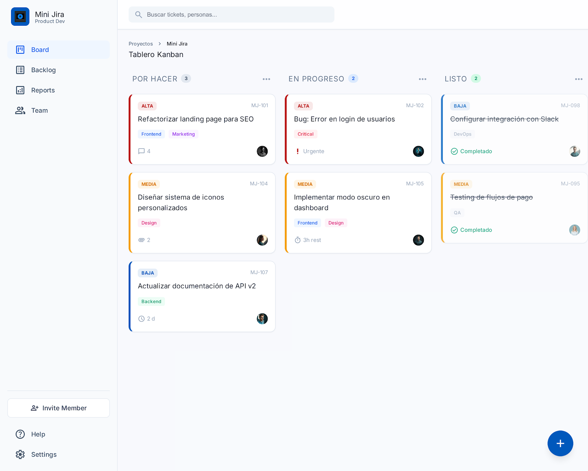

# CicloVida — Mini Jira

Aplicación de gestión de proyectos estilo Jira, construida como proyecto académico con React 19, TypeScript y un sistema de diseño personalizado.



---

## ✨ Funcionalidades

- **Tablero Kanban** con drag & drop entre columnas (Por hacer / En progreso / Review / Listo / Bloqueado)
- **Actualización optimista** con `useOptimistic` de React 19 + rollback automático simulado
- **Gestión de tickets**: crear, editar, archivar, asignar prioridad y etiquetas
- **Comentarios** por ticket con edición y eliminación
- **Sistema de roles**: Admin y Usuario con permisos diferenciados
- **Dashboard** con métricas y gráficas (Recharts)
- **Filtros** por estado, prioridad y búsqueda de texto
- **Detección de concurrencia**: alerta si otro usuario editó el ticket mientras trabajabas
- **Gestión de usuarios** (solo Admin): crear, activar/desactivar cuentas

---

## 🛠️ Stack tecnológico

| Capa | Tecnología |
|---|---|
| Lenguaje | TypeScript 5.x |
| Framework UI | React 19.x |
| Build tool | Vite 6.x |
| Routing | React Router v7 |
| Server state | TanStack Query v5 |
| Client state | Zustand v5 |
| Design System | Shadcn/UI + Tailwind CSS v3 |
| Formularios | React Hook Form v7 |
| Validación | Zod v3 |
| Rich text | Tiptap v2 |
| Drag & drop | @dnd-kit/core v6 |
| Gráficas | Recharts v2 |
| HTTP | Axios v1 |

---

## 🎨 Sistema de diseño

El proyecto implementa un sistema de tokens de color personalizado basado en Material Design 3, con **52 custom properties CSS** mapeadas como utilidades Tailwind. Ningún color genérico de Tailwind (`blue-*`, `gray-*`, etc.) es utilizado — todo pasa por tokens semánticos como `bg-primary`, `text-on-surface`, `border-outline-variant`.

Tipografía: **Inter** con escala tipográfica definida (`headline-xl`, `headline-lg`, `body-md`, `label-sm`, etc.).

---

## 🗂️ Arquitectura

```
frontend/src/
├── types/          # Interfaces globales
├── lib/            # axios, utils, mockSetup, mockData
├── router/         # ProtectedRoute, AdminRoute
├── features/
│   ├── auth/       # store, api, schemas, hooks, components
│   ├── tickets/    # store, api, schemas, hooks, components
│   ├── comments/   # api, hooks, components
│   ├── dashboard/  # api, hooks, components
│   └── admin/      # api, schemas, hooks, components
├── components/
│   ├── ui/         # Re-exports Shadcn/UI
│   └── layout/     # AppShell, Sidebar, TopBar
└── pages/          # Una por ruta
```

---

## 🚀 Cómo ejecutar

```bash
cd frontend
npm install
npm run dev
```

La aplicación corre en `http://localhost:5173`

> **Nota:** El modo mock está activo por defecto (`VITE_MOCK=true` en `.env.development`). No se necesita backend para probar la aplicación.

**Credenciales de prueba:**
- Admin: `admin@ciclovida.com` / `password`
- Usuario: `user@ciclovida.com` / `password`

---

## 📦 Build de producción

```bash
cd frontend
npm run build
```

---

## 👨‍💻 Autor

**Bidcar Herrera** — Proyecto académico  
[github.com/BidcarHerreraDelivery](https://github.com/BidcarHerreraDelivery)

